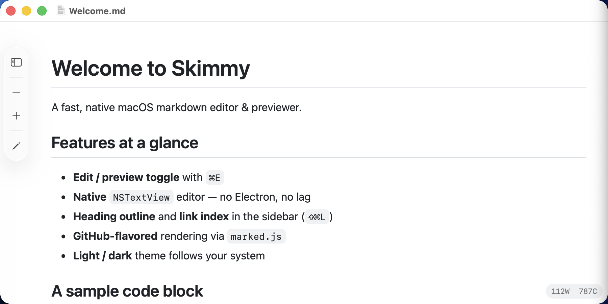
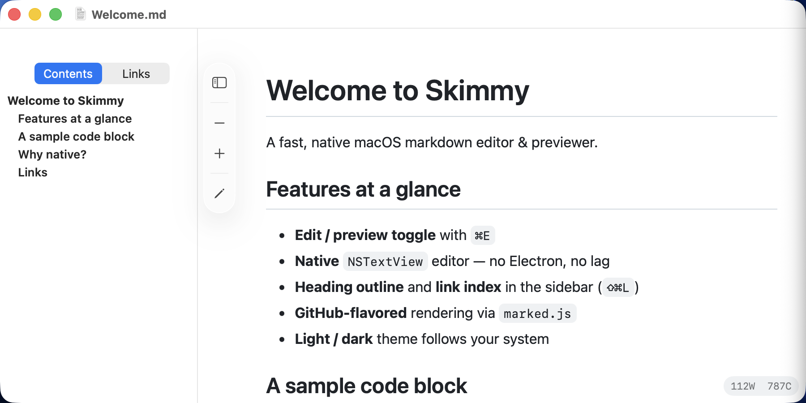
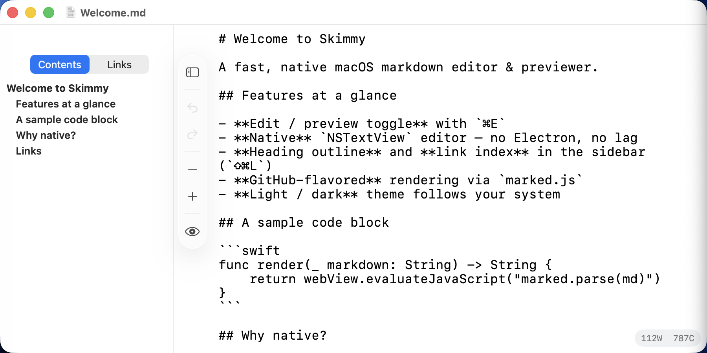

# Skimmy

*A fast, native macOS markdown editor & previewer.*

[]()
[]()
[](LICENSE)
[](https://github.com/sponsors/giulioc84)

> **Source-available, not open-source.** The code is published so you can
> read, audit, and file precise bug reports. It is **not licensed** for reuse,
> forking, or redistribution. See [`LICENSE`](LICENSE) and
> [`CONTRIBUTING.md`](CONTRIBUTING.md).

---

## Why Skimmy?

Skimmy is a minimal, native macOS editor for `.md` files. Unlike Electron-based
editors, it uses AppKit's `NSTextView` for the editor and `WKWebView` for the
preview, so it launches instantly, scrolls smoothly, and feels at home on macOS.

No tabs, no plugins, no cloud. Open a file, write markdown, see it rendered.



### Navigator

The sidebar (`⇧⌘L`) gives you a heading outline *and* a link index — click any
entry to jump straight there.



### Editor

Toggle to edit mode with `⌘E`. Monospaced, native undo/redo, no auto-correct
surprises.



## Features

### Editing
- Native `NSTextView`-backed editor with full undo/redo and system find bar (`⌘F`)
- Monospaced fonts with adjustable size (`⌘=`, `⌘-`, `⌘0`), persisted across launches
- Auto-correct, smart quotes, smart dashes, and link detection explicitly **off** — no markdown-breaking surprises

### Preview
- Instant GitHub-flavored rendering via [marked.js](https://github.com/markedjs/marked) inside `WKWebView`
- Automatic light / dark theme via `prefers-color-scheme`
- Clickable links open in the default browser (not in-app)

### Navigation
- Toggleable sidebar (`⇧⌘L`) with two tabs:
  - **Contents** — full H1–H6 outline, click to scroll
  - **Links** — every inline `[text](url)`, image ``, and autolink `<url>`
- Debounced parsing on a background thread (300 ms) so large docs stay responsive

### Files & windows
- Native `DocumentGroup` integration — proper Open / Save / Save As / Recents
- Registered as Owner for `.md`, `.markdown`, `.mdown`
- Welcome screen with up to 10 recent documents
- Save-confirmation dialog when leaving edit mode with unsaved changes
- Visual-effect (blur) window background

### Keyboard shortcuts

| Shortcut  | Action                    |
| --------- | ------------------------- |
| `⌘E`      | Toggle edit / preview     |
| `⇧⌘L`     | Toggle sidebar            |
| `⌘S`      | Save                      |
| `⌘F`      | Find in editor            |
| `⌘=`/`⌘-` | Increase / decrease font  |
| `⌘0`      | Reset font size           |

## Install

The compiled Skimmy app will be distributed from the author's website (coming
soon). In the meantime — or if you prefer — you can build from source below.

Skimmy releases are signed with an **Apple Developer ID** certificate and
**notarized by Apple**, so macOS opens them cleanly without Gatekeeper warnings.

## Build from source

Prerequisites: **Xcode 26.0+**, **Homebrew**.

```sh
brew install xcodegen

git clone https://github.com/giulioc84/skimmy_markdown.git
cd skimmy_markdown
make install   # generates .xcodeproj, builds Release, signs, installs to /Applications
open -a Skimmy
```

Available `make` targets:

| Target         | Purpose                                                                   |
| -------------- | ------------------------------------------------------------------------- |
| `make generate`| Produce `.xcodeproj` via XcodeGen                                         |
| `make build`   | Build Release configuration                                               |
| `make install` | Build + sign + copy to `/Applications`                                    |
| `make sign`    | Re-sign `/Applications/Skimmy.app`                                        |
| `make notarize`| Submit to Apple, wait, and staple the ticket                              |
| `make release` | `install` + `notarize` + zip into `dist/Skimmy-<ver>.zip` (shippable)     |
| `make clean`   | Delete `.build/`, `.xcodeproj`, and `dist/`                               |

### Cutting a release

```sh
# Bump to a new version and produce a shippable zip in one command
make release VERSION=1.0.1

# Or, if you've already bumped project.yml manually:
make release
```

`make release` takes 5–90 minutes — most of it is Apple's notarization queue.
The final artifact (`dist/Skimmy-<ver>.zip`) is signed, notarized, and stapled —
upload it directly to your website's download page.

### Code signing

`make install` auto-detects the first **Apple Development** certificate in your
keychain and signs the installed app with it. If you have an Apple ID signed
into Xcode, this just works — no Makefile edits needed.

To override the identity:

```sh
# Use a specific certificate by full name or SHA-1 hash
SIGN_IDENTITY="Apple Development: Jane Doe (ABCD123456)" make install

# Build unsigned (Gatekeeper will warn on every open — fine for local testing)
SIGN_IDENTITY=- make install
```

List your installed signing identities with:

```sh
security find-identity -v -p codesigning
```

For App Store or wider distribution, set `SIGN_IDENTITY` to an **Apple Developer
ID Application** certificate and add a notarization step (`xcrun notarytool`).

## Project layout

```
Skimmy/
├── App/            # Entry point (SkimmyApp.swift), DocumentGroup, menu commands
├── Model/          # MarkdownDocument, parsers (headings, links)
├── Views/          # SwiftUI + NSViewRepresentable wrappers (editor, reader, sidebar)
├── Utilities/      # Debounced parsing, persisted settings, window helpers
└── Resources/      # Info.plist, marked.min.js, Assets.xcassets
```

## Tech stack

- **SwiftUI** (macOS 26+, Swift 5.9)
- **NSTextView** for the editor (wrapped in `NSViewRepresentable`)
- **WKWebView** + **marked.js** for the preview
- **XcodeGen** (`project.yml` → `.xcodeproj`)

## Versioning

Skimmy follows [Semantic Versioning](https://semver.org): `MAJOR.MINOR.PATCH`.

| Segment | Bumped when… |
|---|---|
| **MAJOR** (`x`.y.z) | Breaking changes, significant redesigns, incompatible reworks |
| **MINOR** (x.`y`.z) | New features, small additions, backwards-compatible changes |
| **PATCH** (x.y.`z`) | Bug fixes, typo corrections, internal cleanup with no behavior change |

See [`CHANGELOG.md`](CHANGELOG.md) for the full version history. The current
version ships in `project.yml` as `MARKETING_VERSION`.

## Contributing

This is a personal project; the repo is private and not currently accepting PRs.
If you find a bug, please open an issue — I'd love to hear about it.

## Support the project ❤️

If Skimmy saves you time, consider [sponsoring on GitHub](https://github.com/sponsors/giulioc84).
Every bit helps keep the app maintained.

## License

**Proprietary — All Rights Reserved.** See [`LICENSE`](LICENSE).

The source code in this repository is not open-source. The compiled Skimmy
application is distributed via the author's website (and potentially the
Mac App Store in the future) under a separate end-user license agreement.

Third-party components included in builds (see [`THIRD_PARTY_NOTICES.md`](THIRD_PARTY_NOTICES.md))
remain under their original licenses.
